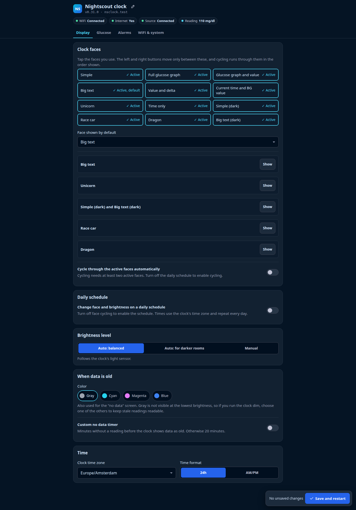
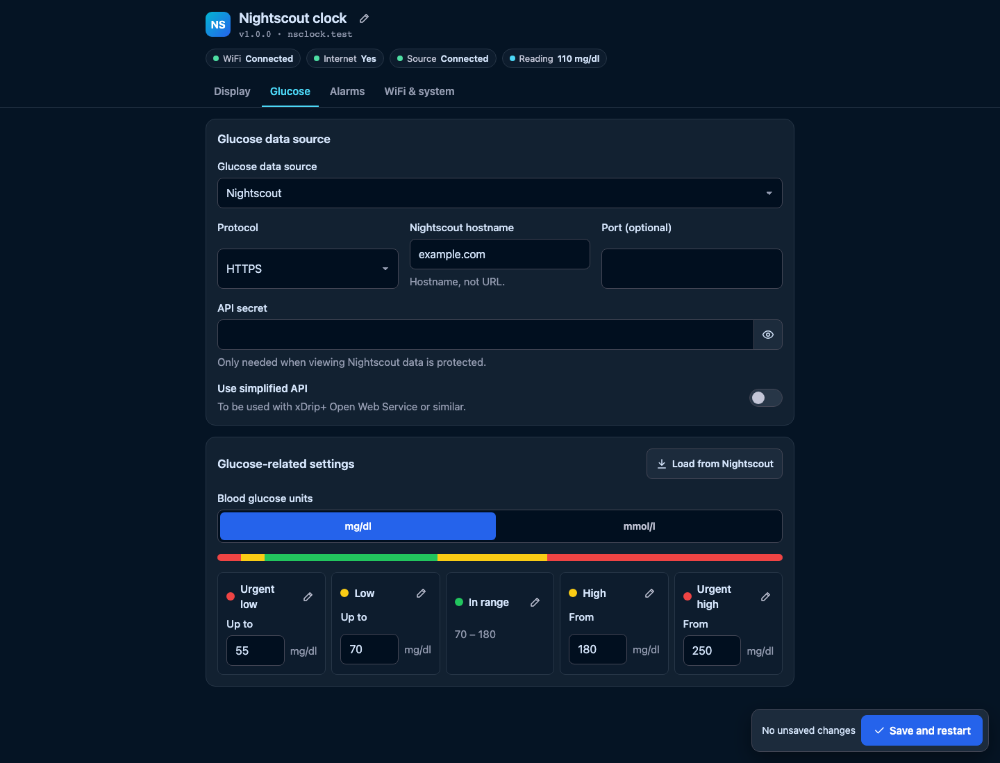
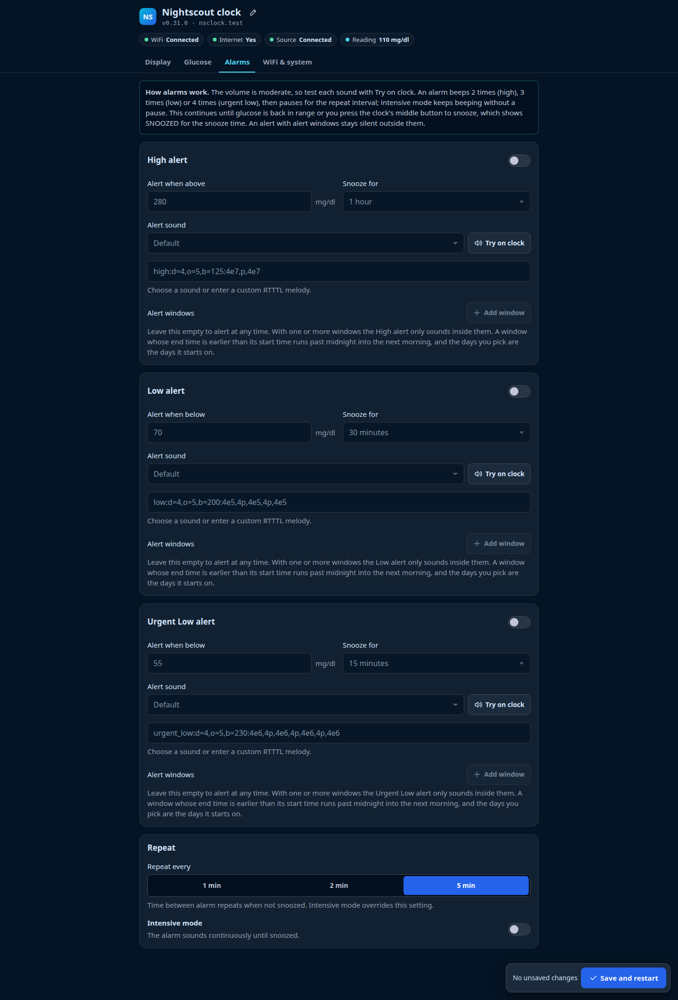
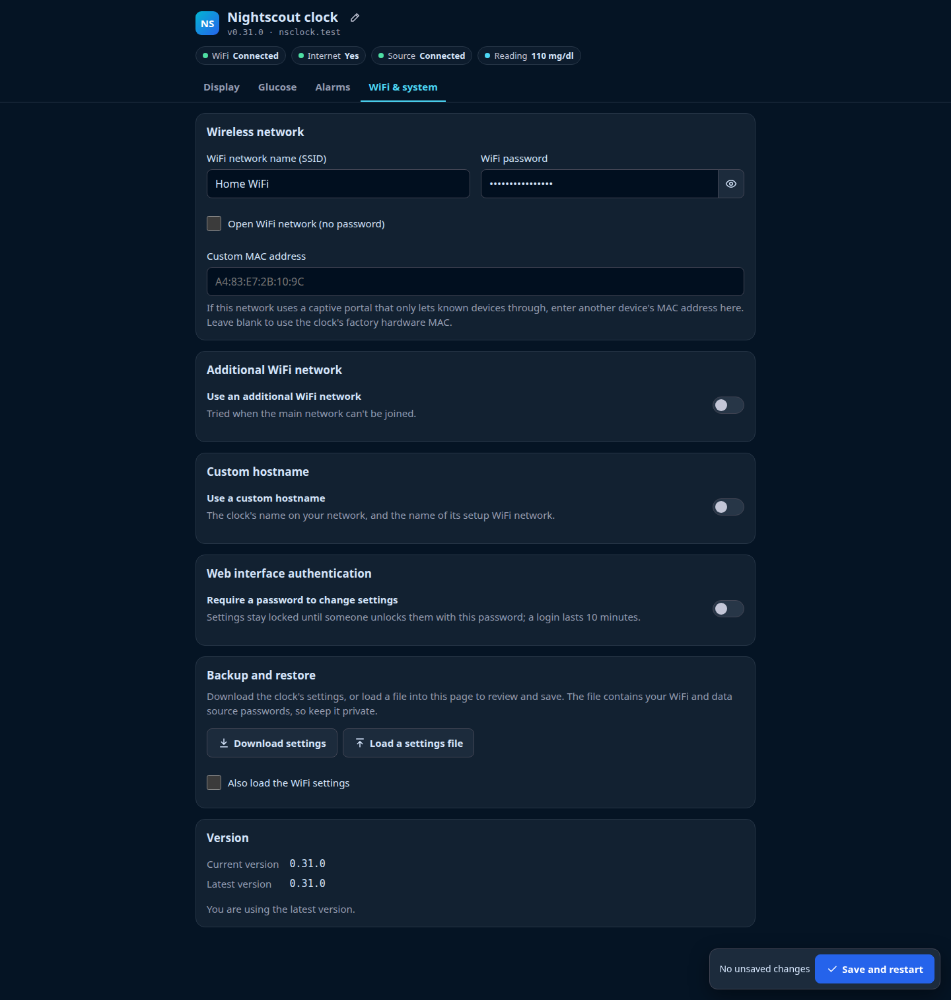

# Nightscout Clock


> [!IMPORTANT]
>
> ## This project is looking for a new maintainer or co-maintainer
>
> Over the past few months, I have not been able to spend as much time as this project deserves on support, maintenance, and development.
>
> Rather than let the project stall, I would like to find someone who is interested in helping maintain it, either together with me or as the new primary maintainer.
>
> If you use Nightscout Clock, have contributed before, or are interested in supporting an open-source project that helps caregivers monitor their loved ones’ glucose values, please get in touch.
>
> You can reach me at **artiom@gmail.com**.

### Current version: 1.0.0


_Nightscout Clock (or NSClock) is an open-source product aimed at helping caregivers of people with type 1 diabetes have peace of mind by being able to better monitor their loved ones' blood glucose values._


## Here is what it can do

- 16 clock faces, including animated characters, dark-room layouts, and a time-only face
- Can get glucose data from Dexcom Share, Nightscout, LibreLink Up or Medtrum EasyFollow
- Supports mg/dl and mmol/l
- 10 minutes setup through web browser
- Configurable low/high limits
- Audible alarms in case the blood sugar is too low or too high
- Automatic brightness adjustment
- Marks stale readings with a configurable color and a cross instead of the trend arrow
- Daily face and brightness schedules, or automatic cycling through your chosen faces
- Offline configuration page with settings backup and restore
- ...and more

### YouTube review

[](https://www.youtube.com/watch?v=7GmDflLxqLs)

Thanks [@CallumMcK](https://github.com/CallumMcK)

## How to install

1. Buy [Ulanzi TC001](https://www.ulanzi.com/products/ulanzi-pixel-smart-clock-2882?aff=1191), it is about $50, so you don't have to sell a kidney, it is available both in US and Europe (Aliexpress sells it as well, for the same price)
2. Wait a few days for the delivery
3. Unpack, turn on (press on `<` and `>` buttons for a few seconds)
4. Connect the USB-C cable (comes with the clock) to your computer
5. Go to the [installation page](https://ktomy.github.io/nightscout-clock/)
6. Follow the instructions. If installation fails, see the [installation troubleshooting discussion](https://github.com/ktomy/nightscout-clock/discussions/57).
7. Once the clock is installed, take out your phone and join `nsclock` wi-fi network. Then go to `http://192.168.4.1/`
8. Set up your device, provide the Wi-Fi network details, your Dexcom, Nightscout, LibreLink Up or Medtrum EasyFollow credentials, glucose warning limits and other parameters
9. You're all set, enjoy!

## How to update

Updates use a full reflash and reset the clock's settings. Make a note of your settings before updating. If your installed version has **Backup and restore**, download a settings file first; after updating, load it on the **WiFi & system** tab, review the settings, and select **Save and restart**. Include network settings when restoring your WiFi connection; the web login must be configured separately.

[](https://www.youtube.com/watch?v=7mFZJ7_EFN4)

Thanks [@CallumMcK](https://github.com/CallumMcK)

## More information

Nightscout Clock is a custom firmware for Ulanzi TC001. It can also run (with minor changes) on AWTRIX-Light custom hardware, so if you need a bigger display, feel free to research.

### Clockfaces

| Name            | Look                                                                                                 | Comment |
| --------------- | ---------------------------------------------------------------------------------------------------- |---------|
| Simple          |  |   Horizontal bars in the bottom of the display <br /> indicate the time since the last reading <br />No bars: less than one minute <br /> 1..5 green bars: 1..5 minutes <br /> 5 yellow bars: 6..19 minutes <br /> value and bars use the configured old-data color from 20 minutes (default threshold) <br /> and the trend arrow is replaced by an X in the same color       |
| BIG DIGITS      |  | Has no age bars, so it can color the value cyan, blue or magenta once the reading is 6, 10 or 15 minutes old, in a color different from the old-data color. The old-data color still takes over at the data-is-old threshold. Off by default; set it in the Big text drawer of the Clock faces card. |
| 3-hours graph   |  |         |
| Graph and value |  |  The dots on the right side replace the trend arrow.<br>2 white dots = horizontal arrow.<br>2 colored dots (white + green) = 45° arrow.<br>3 dots = vertical arrow.<br>4 dots = double arrow.<br>Colored dots above = upward trend.<br>Colored dots below = downward trend. <br /><br /> Dots under the value are the same as <br /> horizontal bars on the other faces.<br /> See "Simple" face for details |
| Delta           |  |         |
| Time and value  |  | The dots on the right side replace the trend arrow.<br>2 white dots = horizontal arrow.<br>2 colored dots (white + green) = 45° arrow.<br>3 dots = vertical arrow.<br>4 dots = double arrow.<br>Colored dots above = upward trend.<br>Colored dots below = downward trend. <br /><br /> For the bottom-side bars see "Simple" face for details |
| Unicorn         |  | A unicorn whose mane of stepped color bands breaks into dim tips: magenta to blue for normal readings, warning or urgent colors outside the configured limits (every other band darker), and the configured old-data color for stale readings. Age bars appear below the value. Contributed by [@JuanMiste](https://github.com/JuanMiste); the picture was redrawn with a larger head and a banded mane in [#201](https://github.com/ktomy/nightscout-clock/pull/201).<br /><br />The mane is still by default; set it to moving (calm, normal or lively) in the Unicorn drawer of the Clock faces card, and choose how it moves: its colors flow down the bands, slide back toward the tips, or hold while a light runs along the bands. While the reading is fresh a low or high mane shows darker stripes, and in the outer quarter of the in-range, low or high band every third band of a moving mane takes the color of the band beyond that edge (green next to the in-range limit, the urgent color next to the urgent limit); dark stripes run past an urgent limit, and the mane stops in the old-data color when data is old. |
| Race car        |  | A white race car speeds toward the value while speed lines stream past, the road slides back and the wheels spin. The speed lines show the glucose color: green in range; yellow with a darker stripe running through when low or high, with the urgent color mixed in near the urgent limit; and red with dark stripes past an urgent limit. For stale readings the whole race stops and is drawn faded, every other pixel, in the configured old-data color. Set the speed (calm, normal or lively) in the Race car drawer of the Clock faces card. Age bars appear below the value. |
| Time only       | | Only the time: hours, minutes and seconds in 24-hour format, or hours, minutes and AM/PM in 12-hour format. Glucose is always hidden, including urgent readings and old or missing data. New glucose alarms are suppressed while this face is selected. Alarms already triggered, including snoozed alarms, continue normally. |
| Simple (dark)   |  | Simple for a dark room: the number in one chosen color (any of the clock's colors except black, set in the Simple (dark) drawer of the Clock faces card), the trend arrow in the glucose range color, and no age bars. Urgent readings draw the number in the urgent color. Old data uses the old-data color. |
| Dragon          |                                                                                                      | A little dragon breathes fire at the value, with age bars below it. The flame is magenta, orchid, purple and violet in range, the Unicorn's colors, and takes the low or high color outside the limits, with a darker stripe, the urgent color mixed in near the urgent limit, and dark stripes past an urgent limit, as on the moving Unicorn mane. When data is old the fire goes out and the dragon is drawn faded in the old-data color. Set the flame's speed (calm, normal or lively) in the Dragon drawer of the Clock faces card. |
| Big text (dark) |  | Big text's large digits in the Simple (dark) number color, readable across a dark room; the trend arrow in the glucose range color, and no age bars. Both dark faces share one number color setting. |
| Diagnostics | | Scrolling date/time and glucose information. |
| Battery/uptime | | Battery status and device uptime. |
| Rainbow big text | | Large glucose text with an animated rainbow; stale readings blink. |
| Smiley | | Happy in range, sad when low, concerned when high, and neutral for stale or missing data. |

#### Active clock faces

The Web UI's Clock faces card selects which faces are active. All of them are active out of the box, and so is any face added by a later update; turning off the ones you never use shortens what the left and right buttons move between, and the default face is chosen among the active ones.

#### Automatic clock-face cycling

Automatic cycling can be enabled in the same card, and runs through the active faces in the order shown, so at least two of them must be active. Choose how often the face should change: 10 or 30 seconds, or 1, 2, 3, or 5 minutes.

While cycling is enabled, the left and right buttons restart the interval without stopping automatic cycling. The default-face setting is hidden until automatic cycling is turned off again.

#### Face and brightness schedule

The **Daily schedule** card on the **Display** tab can change the clock's face and brightness at up to eight times each day. Each row gives a time, an active face, and a manual brightness level or automatic mode. That selection lasts until the next row, including overnight. For example, use Big text in the morning and Simple at brightness 1 in the evening. The buttons still change the face between rows. Scheduling and automatic cycling cannot both be on; until the clock knows the time, it stays on its default face.

### Configuration web interface

The settings page works offline and adapts to desktop and phone screens. Four tabs group the controls; changes take effect when you select **Save and restart**. Use the pencil beside the heading to name your clock.

The screenshots below show the 1.0 settings interface with sample data, captured before the version bump.

#### Display

Choose active clock faces, face-specific colors and animations, automatic cycling or a daily schedule, brightness, old-data behavior, and time settings.



#### Glucose

Connect your data source and configure glucose units, range limits, and colors.



#### Alarms

Configure high, low, and urgent-low alarms, including sounds, snooze durations, alert windows, and repeat behavior.



#### WiFi & system

Set up WiFi, an optional secondary network, a custom MAC address or hostname, and web login protection. This tab also shows the firmware version and provides settings backup and restore.



The **Backup and restore** card downloads the clock's settings as a file and loads a file into the page for review before saving. WiFi settings are loaded only when requested; the web login is never imported. The file contains WiFi and data source passwords, so keep it private.

### Alarm settings

High, low, and urgent-low alarms each have their own threshold, snooze duration, sound, and optional alert windows in the Web UI.

- Choose one or more alert windows by weekday and start/end time. With no windows, an enabled alarm can sound at any time. Windows use the clock's configured timezone; an overnight window starts on the selected weekday and continues into the next morning. If the clock has not obtained the time yet, it allows alarms regardless of their windows.
- Set the repeat interval to 1, 2, or 5 minutes (default). Intensive mode overrides this and repeats every 2 seconds.
- Choose the default sound, one of six sound presets, or a custom RTTTL melody. The **Try** button plays the current melody on the clock without saving, even if that alarm is disabled.

### Features (technical stuff, feel free to ignore)

- Web-based installation (no need to install flashing tools, you just need the clock and a web browser). The clock hosts a website where the user can configure all the parameters (data source, limits, alarms, display)
  - Access-Point mode to set the initial configuration
  - Support for a secondary WiFi (e.g. if you want to take the clock in your car for a long trip)
  - Support for WPA-Enterprise
  - Ability to set a custom hostname in case you have multiple NSClocks on the same network
  - A name for each clock (such as Kitchen or Bedroom), set with the pencil beside the Web UI heading and shown as the page heading and browser tab title
- Simple glucose value display with trend arrow
- Changing color based on limits. Each glucose range's color (red, yellow, green, yellow, red by default) can be changed next to its limit in the Web UI, and every face follows it
- Nightscout data source, the clock gets units type and value boundaries from Nightscout (see [how to](https://youtu.be/GGiep2gdx_o) set up using [Nightscout.pro](https://www.nightscout.pro/) as data source)
- [Juggluco](https://www.juggluco.nl/) data source (support for HTTP Nightscout endpoints)
- [Improv Wi-Fi](https://github.com/improv-wifi) compatibility (setting up WiFi during the installation)
- [Gluroo](https://gluroo.com/) data source (API_SECRET within the URL parameters) (see how to setup [video](https://youtu.be/unG-l6XXWxw))
- Simplified Nightscout API like xDrip+ [Open Web Service](https://github.com/NightscoutFoundation/xDrip/blob/master/Documentation/technical/Local_Web_Services.md) support. When adding it as a data source, choose Nightscout and check the `Simplified API` checkbox. Make sure your source device (e.g. your phone running xDrip) has a static IP address and is on the same WiFi network. Also don't forget to check the port setting; for xDrip it is usually `17580`
- Dexcom Share data source
- LibreLinkUp (libreview) data source
- Medtrum EasyFollow data source
- Medtronic users can bridge data through xDrip+ to Nightscout, then connect the clock to that Nightscout site. See [discussion #53](https://github.com/ktomy/nightscout-clock/discussions/53)
- Brightness adjustment
  - Brightness can be adjusted within the Web UI
  - Automatic brightness adjustment based on the ambient light
  - Double-click on the middle button on the clock turns the display on and off
- Multiple clock faces support
  - Default clock face can be selected in the Web UI
  - Clock faces can be changed using arrow buttons on the clock
  - Faces you do not use can be turned off in the Web UI
  - Active clock faces can cycle automatically at a configurable interval
  - Face and brightness can follow a daily schedule
  - Simple clock face (value and trend arrow)
  - Full-width glucose graph
  - Graph, value and trend indicator
  - BIG DIGITS, with an optional color for a late reading
  - Value, trend and delta
  - Clock and BG value (timezone is set in the clock's web interface)
  - Diagnostics
  - Battery and uptime
  - Rainbow big text with an animated glucose-state-colored rainbow and stale-reading blink
  - Smiley face, reflecting the glucose level with happy, sad, concerned, or neutral expressions
  - Unicorn and glucose value, with mane colors based on glucose limits
  - Race car and glucose value, with speed lines in the glucose color
  - Time only, always hiding glucose and suppressing new alarms while selected; already-triggered alarms continue normally
  - Simple (dark): the number in a color of your choice with the glucose color on the trend arrow, for night
  - Dragon and glucose value, breathing fire in colors based on glucose limits
  - Big text (dark): the same with BIG DIGITS
- Configurable color for old readings and no-data screens: gray (default), cyan, magenta, or blue. Choose it on the Display tab of the Web UI; the alternatives help keep stale readings visible at low brightness
- Smart data and screen update timings: read data once it appears, refresh screen when needed
- API data source. The clock has a simple Nightscout-like API which can receive glucose values from an external source. The main purpose of this feature is the ability to test the clock during the clockfaces development. In order to activate this feature, select the API data source within the clock's Web UI. Here are the endpoints:
  - /api/v1/entries POST endpoint receives an array of Nightscout-like entries. The only significant fields are `sgv`, `date` and `trend` or `direction`. Due to the limited memory the API is stable when sent fewer than 10 records
  - /api/v1/entries DELETE endpoint deletes all entries regardless of the payload
  - `scripts/ns_emulator.py` is a helper that pushes sample readings to this API for testing (e.g. to exercise clock-face moods). Point its `nightscout_url` at your clock, then run `python scripts/ns_emulator.py --one-value 110` for a single reading or `--sin` for a sinusoid history.
- Firmware versioning
- Alarms with configurable thresholds, snooze times, repeat interval, sounds, and weekday/time alert windows
- To turn the device on or off press both arrow buttons for 3 seconds
- To reset the device to factory defaults (hard reset) during boot sequence (when version number is displayed) keep the center (select) button pressed.

### My TODO list

- Add more clock faces
  - Battery, humidity and temperature
- Smooth color change (rainbow) based on the value and boundaries
- Add more data sources
  - ...more... (if you are the author of a CGM data collecting app/service and you want your data to be displayed on the Nightscout Clock, please contact me)

## Changes

### 1.0.0

- Rebuilt the configuration page as a self-contained, offline UI with Display, Glucose, Alarms, and WiFi & system tabs, responsive layouts, and unsaved-change indicators; removed Bootstrap and jQuery dependencies, thanks [@nishanm](https://github.com/nishanm) ([#192](https://github.com/ktomy/nightscout-clock/pull/192))
- Added settings backup and restore: download a configuration file, load it for review, optionally include network settings, and save when ready; web login settings are never imported, thanks [@nishanm](https://github.com/nishanm) ([#197](https://github.com/ktomy/nightscout-clock/pull/197))
- Added daily face and brightness schedules with up to eight changes per day, including overnight use, thanks [@nishanm](https://github.com/nishanm) ([#190](https://github.com/ktomy/nightscout-clock/pull/190))
- Added active-face selection for button navigation, automatic cycling, default-face selection, and scheduling, thanks [@nishanm](https://github.com/nishanm) ([#195](https://github.com/ktomy/nightscout-clock/pull/195))
- Added the Time only face, which hides glucose and suppresses new alarms while selected; already-triggered and snoozed alarms continue normally, thanks [@nishanm](https://github.com/nishanm) ([#193](https://github.com/ktomy/nightscout-clock/pull/193))
- Added Simple (dark) and Big text (dark), sharing a configurable number color while retaining glucose-colored trend arrows and urgent/old-data colors, thanks [@nishanm](https://github.com/nishanm) ([#191](https://github.com/ktomy/nightscout-clock/pull/191), [#200](https://github.com/ktomy/nightscout-clock/pull/200))
- Added the Race car face with animated speed lines, road, and wheels, selectable animation speeds, and a stopped, faded scene for stale readings, thanks [@nishanm](https://github.com/nishanm) ([#203](https://github.com/ktomy/nightscout-clock/pull/203))
- Added the Dragon face with animated flames, selectable animation speeds, and extinguished fire for stale readings, bringing the total to 12 clock faces, thanks [@nishanm](https://github.com/nishanm) ([#202](https://github.com/ktomy/nightscout-clock/pull/202))
- Redrew the Unicorn and added optional mane animation, motion styles, speeds, and twinkling; the mane stops when readings become stale, thanks [@nishanm](https://github.com/nishanm) ([#201](https://github.com/ktomy/nightscout-clock/pull/201))
- Added configurable colors for all five glucose ranges, used throughout the clock faces and graphs, thanks [@nishanm](https://github.com/nishanm) ([#199](https://github.com/ktomy/nightscout-clock/pull/199))
- Added an optional early-stale color to Big text for readings 6, 10, or 15 minutes old; the old-data color takes precedence at the configured old-data threshold, thanks [@nishanm](https://github.com/nishanm) ([#178](https://github.com/ktomy/nightscout-clock/pull/178))
- Replaced stale trend arrows with a cross in the old-data color, thanks [@nishanm](https://github.com/nishanm) ([#194](https://github.com/ktomy/nightscout-clock/pull/194))
- Added editable clock names, shown in the settings heading and browser tab, thanks [@nishanm](https://github.com/nishanm) ([#196](https://github.com/ktomy/nightscout-clock/pull/196))
- Added an optional custom WiFi MAC address, thanks [@adamecker](https://github.com/adamecker) ([#224](https://github.com/ktomy/nightscout-clock/pull/224))
- Fixed fatal-error messages being invisible at minimum brightness or using the large-digit font, thanks [@nishanm](https://github.com/nishanm) ([#207](https://github.com/ktomy/nightscout-clock/pull/207))
- Moved web UI sources to `web/src/` and generated compressed assets during filesystem builds, thanks [@nishanm](https://github.com/nishanm) ([#192](https://github.com/ktomy/nightscout-clock/pull/192))
- Added reproducible screenshots for every settings tab

### 0.31

- Added the Unicorn clock face, showing glucose beside a unicorn whose mane changes color with glucose limits, thanks [@JuanMiste](https://github.com/JuanMiste) ([#181](https://github.com/ktomy/nightscout-clock/pull/181))
- Added configurable colors for old readings and no-data screens, with gray, cyan, magenta, and blue options, thanks [@nishanm](https://github.com/nishanm) ([#177](https://github.com/ktomy/nightscout-clock/pull/177))
- Replaced fixed alarm silence intervals with per-alarm alert windows supporting weekday selection, multiple windows, and overnight schedules, thanks [@nishanm](https://github.com/nishanm) ([#183](https://github.com/ktomy/nightscout-clock/pull/183))
- Added a configurable alarm repeat interval of 1, 2, or 5 minutes; intensive mode still repeats every 2 seconds, thanks [@nishanm](https://github.com/nishanm) ([#184](https://github.com/ktomy/nightscout-clock/pull/184))
- Added six alarm sound presets alongside the default and custom RTTTL melodies, thanks [@nishanm](https://github.com/nishanm) ([#185](https://github.com/ktomy/nightscout-clock/pull/185))
- Improved Dexcom credential guidance and added password-manager autocomplete hints, thanks [@miqcie](https://github.com/miqcie) ([#154](https://github.com/ktomy/nightscout-clock/pull/154))
- Fixed oversized no-data text and clock rendering after switching from a face that uses large text, thanks [@nishanm](https://github.com/nishanm) ([#177](https://github.com/ktomy/nightscout-clock/pull/177))
- Centralized clock face definitions to simplify adding new faces, thanks [@nishanm](https://github.com/nishanm) ([#188](https://github.com/ktomy/nightscout-clock/pull/188))

### 0.30

- Added automatic cycling between selected clock faces, with Web UI validation requiring at least two faces, configurable intervals from 10 seconds to 5 minutes, and left/right navigation limited to the selected faces

### 0.29.1

- Addressed screen refresh, now there should be less flickering due to partial refresh
- Fixed a potential issue in Improv protocol handling (setting wifi from the installation page)
- Fixed a potential filesystem corruption on restarts

### 0.29

- Added Medtronic setup guidance to the WebUI, closes [#147](https://github.com/ktomy/nightscout-clock/issues/147)
- Added web auth in the advanced settings. ([discussion](https://github.com/ktomy/nightscout-clock/issues/72)), thank you [@mrendo](https://github.com/mrendo)
- Added show password option on all password fields, thank you [@mrendo](https://github.com/mrendo)
- Fixed local WebUI password visibility icons after the changes from [#125](https://github.com/ktomy/nightscout-clock/pull/125)

### 0.28

- Fixed email parsing Medtrum credentials input, thanks [@logicafuzzy](https://github.com/logicafuzzy), merged [#127](https://github.com/ktomy/nightscout-clock/pull/127)
- Added support for xDrip+ [Open Web Service](https://github.com/NightscoutFoundation/xDrip/blob/master/Documentation/technical/Local_Web_Services.md) as an extension of the Nightscout data source, resolving [#86](https://github.com/ktomy/nightscout-clock/discussions/86)

### 0.27

- Medtrum EasyFollow data source support ([discussion](https://github.com/ktomy/nightscout-clock/discussions/106)), inspired by [@pachi81](https://github.com/pachi81)'s work
- Fixed Open WiFi networks validation
- Moved trend indicator to the right in the "Time and value" clockface

### 0.26.2

- Implemented LibreLink Up patient selection for multi-patient accounts. Fixed [#65](https://github.com/ktomy/nightscout-clock/issues/65)

### 0.26.1

- Fixed a typo in the WebUI javascript

### 0.26.0

- Added trend indicator to the clock-and-value clock face. [#49](https://github.com/ktomy/nightscout-clock/issues/49)
- Added manual brightness control from the device itself. When the brightness is in manual mode, pressing `<` or `>` for more than a second increases or decreases brightness. Setting persists over restarts. [#74](https://github.com/ktomy/nightscout-clock/issues/74)

### 0.25.2

- Fixed support for Dexcom Japan
- Added custom alarm melodies, which can be set through RTTTL strings in alarm settings

### 0.25.1

- Added support for Dexcom Japan: [#110](https://github.com/ktomy/nightscout-clock/discussions/110)
- Fixed typo in Dexcom credentials error message: [#111](https://github.com/ktomy/nightscout-clock/issues/111)

### 0.25.0

- Implemented Alarm Intensive Mode, addressing [#61](https://github.com/ktomy/nightscout-clock/discussions/61)

### 0.24.4

- Fixed WiFi password validation for Open WiFi networks
- Added possibility of factory resetting the device on start-up (when version string is displaying press the select button)
- Better AP mode handling

### 0.24.3

- Implemented open WiFi connectivity, closing [#105](https://github.com/ktomy/nightscout-clock/issues/105)
- Changed age bars colors so that they do not disappear when the brightness is minimal. [#101](https://github.com/ktomy/nightscout-clock/discussions/101)

### 0.24.2

- Increased version presented to LibreLinkUp servers, closing [#88](https://github.com/ktomy/nightscout-clock/issues/88)

### 0.24

- Added "dark rooms" brightness mode and changed curve for the manual brightness. Thanks [@unxmaal](https://github.com/unxmaal) for [#67](https://github.com/ktomy/nightscout-clock/pull/67)

### 0.23.1

- Fixed trend arrow display on the Big Text clockface when brightness is not in auto mode. [#47](https://github.com/ktomy/nightscout-clock/issues/47)
- Adjusted version display on start-up

### 0.23

- Added version number, update check and link to the updating page to the WebUI. [#10](https://github.com/ktomy/nightscout-clock/issues/10)
- Added development environment setup instructions. [#26](https://github.com/ktomy/nightscout-clock/issues/26)
- Fixed LibreLink Up Server label. [#50](https://github.com/ktomy/nightscout-clock/issues/50)

### 0.22

- Fixed delta for LibreLinkUp source
- Now I can consider LibreLinkUp as being functioning. So closing [#9](https://github.com/ktomy/nightscout-clock/issues/9) and [#27](https://github.com/ktomy/nightscout-clock/issues/27)

### 0.21

- Yet another attempt to fix LibreLinkUp

### 0.20

- Another attempt to get values from LibreLinkUp

### 0.19

- Added custom "Data is old" threshold, (thanks [@TheBeardedTechGuy](https://github.com/TheBeardedTechGuy) for [#43](https://github.com/ktomy/nightscout-clock/pull/43))
- Added glucose age display as bars in the bottom part of most of the clockfaces (thanks [@TheBeardedTechGuy](https://github.com/TheBeardedTechGuy) for [#41](https://github.com/ktomy/nightscout-clock/pull/41))

### 0.18

- Fixed Nightscout domain name validation, closed [#39](https://github.com/ktomy/nightscout-clock/issues/39)

### 0.17

- Added API endpoint to switch display power on and off as in the example below

```
curl -X POST http://nsclock.lan/api/displaypower \
  -H "Content-Type: application/json" \
  -d '{"power": "off"}'
```

### 0.16

- Another attempt to fix [#25](https://github.com/ktomy/nightscout-clock/issues/25) and [#31](https://github.com/ktomy/nightscout-clock/issues/31)

### 0.15

- Fixed delta showing 0 when there are multiple sources uploading data to Nightscout. [#25](https://github.com/ktomy/nightscout-clock/issues/25)
- Implemented WPA-Enterprise connectivity (Wifi type selector available for additional WiFi network). [#23](https://github.com/ktomy/nightscout-clock/issues/23)
- Fixed project dependencies divergence. [#30](https://github.com/ktomy/nightscout-clock/issues/30)
- Implemented possibility of setting custom hostname. [#18](https://github.com/ktomy/nightscout-clock/issues/18)
- Implementing possibility of having additional WiFi network. [#7](https://github.com/ktomy/nightscout-clock/issues/7)

### 0.14

- Updated README to be more customer-friendly
- Started preparing for LibreLink Up data source integration, [#9](https://github.com/ktomy/nightscout-clock/issues/9))
- Improved memory management to avoid NOMEMORY issues and unplanned restarts, [#19](https://github.com/ktomy/nightscout-clock/issues/19)
- Improved WiFi SSID validation, [#16](https://github.com/ktomy/nightscout-clock/issues/16)
- Fixed typos in Web UI (thanks @motinis)

### 0.13

- Finished alarms feature
- Improved WiFi reconnection handling [#15](https://github.com/ktomy/nightscout-clock/issues/15)
- Migrated development environment to Linux
- Removed boot sound

## Do you want to contribute?

Please read the [Contriburing](https://github.com/ktomy/nightscout-clock/blob/main/CONTRIBUTING.md) instructions

---

The code is heavily inspired by (has a lot of copy-pasted code from :D ) [AWTRIX Light](https://github.com/Blueforcer/awtrix-light) project.
